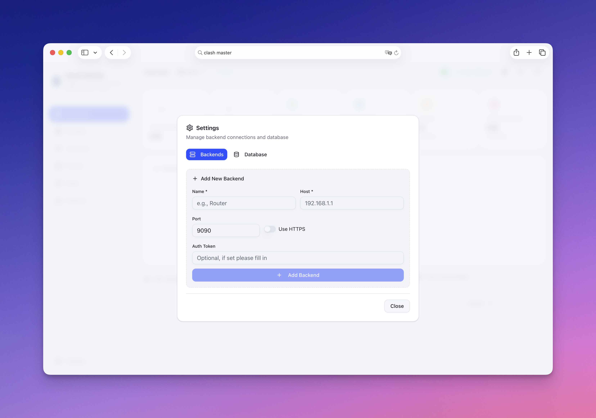

<p align="center">
  
  <br>
  <b style="font-size: 32px;">Clash Master</b>
</p>

<p align="center">
  <b>A more beautiful and modern web application that lets you visualize and manage your Clash network traffic</b><br>
  <span>Real-time Monitoring · Multi-dimensional Analysis · Multi-Backend Management</span>
</p>

<p align="center">
  <a href="https://github.com/foru17/clash-master/stargazers"></a>
  <a href="https://github.com/foru17/clash-master/releases"></a>
  <a href="https://github.com/foru17/clash-master/blob/main/LICENSE"></a>
  
  
</p>

<p align="center">
  <a href="./README.md">简体中文</a> •
  <b>English</b>
</p>


## 🤔 Preface

From concept to this complete version, this project took only **4 hours**. The core MVP was completed in just **1 hour** ([Tweet](https://x.com/luoleiorg/status/2019418455276204185)).

Thanks to [@Kai](https://x.com/real_kai42) for providing [Kimi Code](https://www.kimi.com/code/console) Allegretto subscription support.

Throughout the entire development process, I didn't write a single line of code myself (didn't even open an IDE) — all handed over to [Kimi K2.5](https://www.kimi.com/code/console). As a veteran of Vibe Coding, this experience with Kimi still surprised me: **no usage limits, no Token anxiety**. Made-in-China AI, the future is promising.

## 📋 Table of Contents

- [🤔 Preface](#-preface)
- [📋 Table of Contents](#-table-of-contents)
- [✨ Features](#-features)
- [🚀 Quick Start](#-quick-start)
  - [Option 1: Docker Compose (Recommended)](#option-1-docker-compose-recommended)
  - [Option 2: Docker Run](#option-2-docker-run)
  - [Option 3: Source Code](#option-3-source-code)
- [📖 First Use](#-first-use)
- [🐳 Docker Configuration](#-docker-configuration)
  - [Ports](#ports)
  - [Data Persistence](#data-persistence)
  - [Custom Ports](#custom-ports)
  - [Update to Latest](#update-to-latest)
- [📁 Project Structure](#-project-structure)
- [🔧 FAQ](#-faq)
- [🛠️ Tech Stack](#️-tech-stack)
- [🤝 Contributing](#-contributing)
- [📄 License](#-license)
- [⭐ Star History](#-star-history)

## ✨ Features

| Feature                     | Description                                                   |
| --------------------------- | ------------------------------------------------------------- |
| 📊 **Real-time Monitoring** | WebSocket real-time collection with millisecond latency       |
| 📈 **Trend Analysis**       | Multi-dimensional traffic trends: 30min / 1h / 24h            |
| 🌐 **Domain Analysis**      | View traffic, associated IPs, and connection count per domain |
| 🗺️ **IP Analysis**          | ASN, geo-location, and associated domain display              |
| 🚀 **Proxy Statistics**     | Traffic distribution and connection count per proxy node      |
| 🌙 **Dark Mode**            | Light / Dark / System theme support                           |
| 🌍 **i18n Support**         | English / Chinese seamless switching                          |
| 🔄 **Multi-Backend**        | Monitor multiple OpenClash backend instances simultaneously   |

## 🚀 Quick Start

### Option 1: Docker Compose (Recommended)

```bash
# 1. Clone the repository
git clone https://github.com/foru17/clash-master.git
cd clash-master

# 2. Build and start services
docker compose up -d --build

# 3. Open http://localhost:3000 to configure
```

### Option 2: Docker Run

```bash
# 1. Clone the repository
git clone https://github.com/foru17/clash-master.git
cd clash-master

# 2. Build the image
docker build -t clash-master:latest .

# 3. Create data directory and run container
mkdir -p clash-master-data
docker run -d \
  --name clash-master \
  -p 3000:3000 \
  -p 3001:3001 \
  -p 3002:3002 \
  -v $(pwd)/clash-master-data:/app/data \
  --restart unless-stopped \
  clash-master:latest

# 4. Open http://localhost:3000 to configure
```

> 💡 **Note**: Images will soon be published to GHCR, then you can use `ghcr.io/foru17/clash-master:latest` directly.

### Option 3: Source Code

```bash
# 1. Clone the repository
git clone https://github.com/foru17/clash-master.git
cd clash-master

# 2. Install dependencies
pnpm install

# 3. Start services
./start.sh

# 4. Open http://localhost:3000 to configure
```

## 📖 First Use



1. Open <http://localhost:3000>
2. The **Backend Configuration** dialog will appear on first visit
3. Fill in your OpenClash connection info:
   - **Name**: Custom name (e.g., "Home")
   - **Host**: OpenClash backend address (e.g., `192.168.101.1`)
   - **Port**: OpenClash backend port (e.g., `9090`)
   - **Token**: Fill if Secret is configured, otherwise leave empty
4. Click "Add Backend" to save
5. The system will automatically start collecting data

> 💡 **Get OpenClash Address**: OpenClash Plugin → Enable "External Control" → Copy address

## 🐳 Docker Configuration

### Ports

| Port |  Purpose  | Required | Description                 |
| :--: | :-------: | :------: | :-------------------------- |
| 3000 |  Web UI   |    ✅    | Frontend access port        |
| 3001 |    API    |    ✅    | REST API port               |
| 3002 | WebSocket |    ✅    | Real-time data transmission |

### Data Persistence

Data is stored in `/app/data` inside the container. Mount it to host to prevent data loss:

```yaml
volumes:
  - ./data:/app/data
```

### Custom Ports

Create `docker-compose.override.yml` to customize ports:

```yaml
services:
  clash-master:
    ports:
      - "8080:3000" # Map 3000 to host's 8080
```

### Update to Latest

```bash
# Docker Compose (local build)
docker compose up -d --build

# Docker Compose (remote image, coming soon)
docker compose pull
docker compose up -d
```

## 📁 Project Structure

```
clash-master/
├── docker-compose.yml      # Docker Compose config
├── Dockerfile              # Docker image build
├── docker-start.sh         # Docker startup script
├── start.sh                # Source startup script
├── assets/                 # Screenshots and icons
├── apps/
│   ├── collector/          # Data collection service (Node.js + WebSocket)
│   └── web/                # Next.js frontend app
└── packages/
    └── shared/             # Shared types and utilities
```

## 🔧 FAQ

<details>
<summary><b>Q: Failed to connect to OpenClash?</b></summary>

Check the following:

1. Is "External Control" enabled in OpenClash?
2. Is the OpenClash address correct? (Format: `IP:Port`)
3. If Secret is configured, is the Token correct?
4. Can the container access OpenClash's network? (Check firewall settings)

</details>

<details>
<summary><b>Q: How to backup data?</b></summary>

Data is stored in the mapped directory (default `./data/stats.db`). Simply backup this directory:

```bash
cp -r ./data ./data-backup-$(date +%Y%m%d)
```

</details>

<details>
<summary><b>Q: How to clean up historical data?</b></summary>

1. Click "Backend Config" at the bottom of the left sidebar
2. Switch to the "Database" tab
3. Select cleanup range: 1 day / 7 days / 30 days / All

</details>

<details>
<summary><b>Q: Support remote access?</b></summary>

Yes. Map Docker ports to public IP to access remotely. Recommendations:

- Use Nginx reverse proxy
- Enable HTTPS encryption
- Configure authentication

</details>

## 🛠️ Tech Stack

- **Frontend**: [Next.js 15](https://nextjs.org/) + [React 19](https://react.dev/) + [TypeScript](https://www.typescriptlang.org/)
- **Styling**: [Tailwind CSS](https://tailwindcss.com/) + [shadcn/ui](https://ui.shadcn.com/)
- **Charts**: [Recharts](https://recharts.org/)
- **i18n**: [next-intl](https://next-intl-docs.vercel.app/)
- **Backend**: [Node.js](https://nodejs.org/) + [Fastify](https://www.fastify.io/) + WebSocket
- **Database**: [SQLite](https://www.sqlite.org/) ([better-sqlite3](https://github.com/WiseLibs/better-sqlite3))
- **Build**: [pnpm](https://pnpm.io/) + [Turborepo](https://turbo.build/)

## 🤝 Contributing

Contributions are welcome!

- 🐛 [Submit Bug](https://github.com/foru17/clash-master/issues/new)
- 💡 [Request Feature](https://github.com/foru17/clash-master/issues/new)
- 🔧 [Contribute Code](https://github.com/foru17/clash-master/pulls)

## 📄 License

[MIT](LICENSE) © [foru17](https://github.com/foru17)

---

## ⭐ Star History

[](https://www.star-history.com/#foru17/clash-master&type=date&legend=top-left)

---

<p align="center">
  <sub>Made with ❤️ by <a href="https://github.com/foru17">@foru17</a></sub><br>
  <sub>If this project helps you, please consider giving it a ⭐</sub>
</p>
